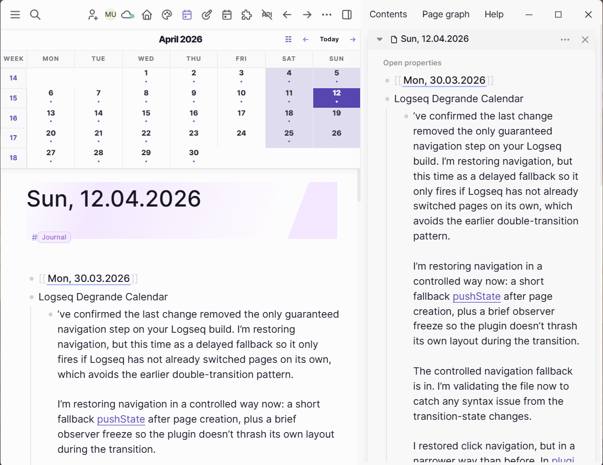
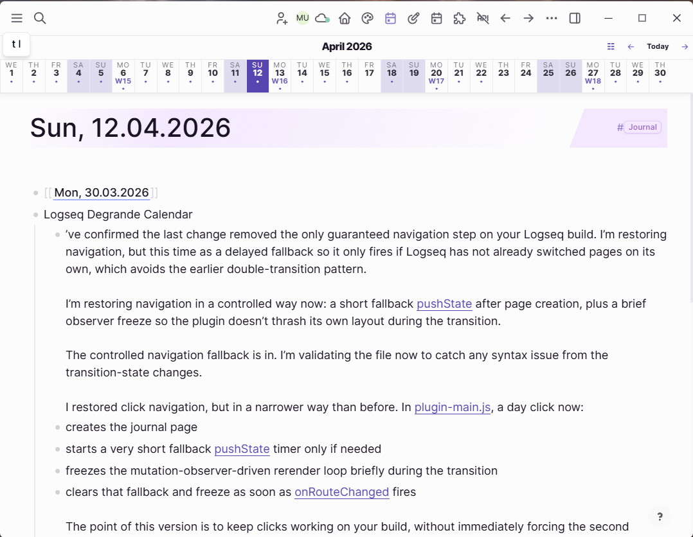

# Degrande Calendar

Degrande Calendar adds a focused week bar to Logseq DB journals. It sits in Logseq's pagebar area, shows your configured week span, and lets you jump straight to a journal day without taking over the rest of the app UI.

> This plugin is currently targeted at Logseq DB graphs.

## Highlights

- Week view for journals with a configurable first day of week.
- Previous week, next week, and today controls.
- One-click journal navigation for each day in the visible week.
- Week-shift animation inside the calendar bar.
- Plugin settings for selecting the first day of the week.
- Built on supported Logseq plugin APIs such as `registerUIItem("pagebar")`, `onRouteChanged`, `getCurrentPage`, and `createJournalPage`.

## Load Unpacked Plugin

1. Open Logseq Desktop.
2. Enable Developer mode.
3. Open the Plugins dashboard.
4. Choose `Load unpacked plugin`.
5. Select the `logseq-db-degrande-calendar` folder.

## Notes

- Open the plugin settings to choose the first day of the week.
- The week bar appears for journal pages and journals view contexts.
- Additional settings can be layered on this structure over time.